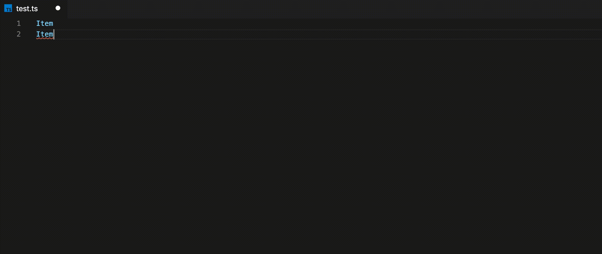

# id-generator

Generate incremented IDs from a starting index. Especially helpful for generating IDs for test data!

## Usage
- Create a number of lines that you want to apply an ID to
- Create a cursor at the preferred spot on each line
- Press CTRL/CMD + SHIFT + P to open the command palette
- Select "Generate IDs from Index" from the command palette
- Enter the starting index number
- Enjoy your new numbers!

## Demo

